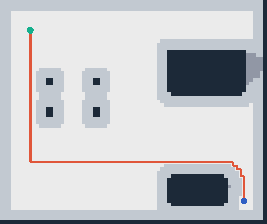

# SimScene Agent

SimScene Agent 是一个面向**整场景重建、仿真导入和导航验证**的可审计 agent / harness 基线。输入是一段带相机标定的 RGB-D 场景序列，输出是可查看的房间级网格、带 RGB 纹理的部件资产、碰撞与关节模型、场景图、占据栅格和经过仿真复核的导航路径。

仓库的主 demo 严格按七层执行。每层都写出 JSON 合同和可复查的中间产物，L7 只接受独立检查通过的结果，不让语言模型自行宣布“看起来正确”。

## 快速运行

推荐使用仓库内的虚拟环境：

```bash
cd simscene-agent
python3 -m venv .venv
.venv/bin/pip install numpy scipy scikit-image trimesh pillow mujoco pytest
PYTHONPATH=src .venv/bin/python -m simscene_agent.seven.run \
  --out examples/generated/seven_layer_scene \
  --scene living_room
```

同一条七层流程还提供两个不同布局：

```bash
PYTHONPATH=src .venv/bin/python -m simscene_agent.seven.run --out examples/generated/seven_layer_office --scene office
PYTHONPATH=src .venv/bin/python -m simscene_agent.seven.run --out examples/generated/seven_layer_corridor --scene corridor
```

也可以一次生成所有回归示例：

```bash
PYTHONPATH=src .venv/bin/python scripts/generate_demos.py
```

主结果位于 `examples/generated/seven_layer_scene/`；另外两个场景位于同级的 `seven_layer_office/` 和 `seven_layer_corridor/`。首先查看：

```text
run_summary.json                         # 七层总验收
L0_spec.json                             # 任务、坐标和硬约束
L1_observe/capture/                      # RGB、米制深度、mask、标定和位姿
L1_observe/observations.json             # 输入完整性与深度覆盖证据
L2_route/routes.json                     # 每个实例选择的重建/纹理/碰撞路线
L3_geometry/scene_surface.ply            # projective TSDF 提取的场景表面
L3_geometry/*.ply                        # 每个标注部件的几何
L4_parts/*/visual.obj + material_0.png   # 带 RGB 投影纹理的可编辑 Mesh 部件
L4_parts/scene.glb                       # 保留的 Mesh 带纹理预览
L4_visual/scene.splat.ply                # 独立 3DGS-compatible 视觉表示
L4_visual/gaussian_preview.png           # CPU Gaussian 预览
L4_visual/transforms.json                # 可交给 Nerfstudio/gsplat 的相机合同
L5_simulation/scene.xml                   # MuJoCo 可加载场景
L5_simulation/collision/*.obj             # 每个部件的闭合碰撞代理
L5_simulation/simulation.json             # 接触、关节和有限状态检查
L6_layout/scene_graph.json                # 对象和空间关系
L6_layout/navigation_path.png             # 占据图与 A* 路径
L7_verify/navigation_rollout.json         # MuJoCo 路径回放
L7_verify/verification.json               # 独立验收和失败定位
```



## Demo 项目

打开 [Demo 结果目录](https://github.com/pm1255/Simscene-agent/tree/main/examples/generated) 查看三个完整七层场景：

- [客厅场景](https://github.com/pm1255/Simscene-agent/tree/main/examples/generated/seven_layer_scene)：[导航预览](https://github.com/pm1255/Simscene-agent/blob/main/examples/generated/seven_layer_scene/L6_layout/navigation_path.png)，[七层验收摘要](https://github.com/pm1255/Simscene-agent/blob/main/examples/generated/seven_layer_scene/run_summary.json)
- [办公室场景](https://github.com/pm1255/Simscene-agent/tree/main/examples/generated/seven_layer_office)：[导航预览](https://github.com/pm1255/Simscene-agent/blob/main/examples/generated/seven_layer_office/L6_layout/navigation_path.png)，[七层验收摘要](https://github.com/pm1255/Simscene-agent/blob/main/examples/generated/seven_layer_office/run_summary.json)
- [走廊场景](https://github.com/pm1255/Simscene-agent/tree/main/examples/generated/seven_layer_corridor)：[导航预览](https://github.com/pm1255/Simscene-agent/blob/main/examples/generated/seven_layer_corridor/L6_layout/navigation_path.png)，[七层验收摘要](https://github.com/pm1255/Simscene-agent/blob/main/examples/generated/seven_layer_corridor/run_summary.json)

每个目录都对应同一条 L1–L7 流程，包含 Mesh 和 Gaussian 两套视觉结果、MuJoCo 场景、碰撞代理、场景图、导航栅格和独立验收报告。仓库内提供 `scripts/generate_demos.py` 重新生成这些结果。

真实机器人视频的输入合同和 DROID 数据源说明见 [`examples/robot_video_3dgs/README.md`](examples/robot_video_3dgs/README.md)。原始视频不随仓库分发，下载和再分发时应遵守数据集自己的许可证。

## 七层的实际职责

1. **L1 观测与坐标校验**：读取 RGB、`camera_z_m` 深度、mask、内参和 `T_world_camera`，检查文件哈希、形状、刚体位姿、深度覆盖和实例身份。
2. **L2 证据路由与预算**：根据可用证据决定使用 projective RGB-D/TSDF、部件重建、RGB 可见性投影、Gaussian bootstrap 和 AABB 碰撞代理。没有深度或位姿的 provider 会明确标记为不可用，不会静默伪造几何。
3. **L3 几何与外观融合**：把每帧深度投影到统一世界坐标，在体素网格上做截断有符号距离融合，用 marching cubes 提取零等值面，并按最近观测把面归属到部件。
4. **L4 部件、纹理与双视觉表示**：保留原有独立 OBJ/GLB 和 RGB atlas；同时从注册 RGB-D 观测导出独立的 3DGS-compatible Gaussian PLY 和相机合同。Gaussian 只负责视觉，不进入碰撞、占据图或物理计算。当前 PLY 是确定性的 observed-surface bootstrap；安装 CUDA splat trainer 后，可以用同一份 `transforms.json` 替换成训练后的 splat。
5. **L5 碰撞、质量、关节与仿真资产**：从部件包围盒生成闭合碰撞 OBJ，给出质量/摩擦先验；生成包含 21 个部件、柜门 hinge 和导航探针的 MuJoCo XML，实际运行重力接触和铰链目标测试。
6. **L6 场景图、占据图与导航**：只使用 L5 碰撞代理建立 2D 占据栅格，按机器人半径膨胀未知和障碍区域，输出场景关系图并用 A* 求起点到终点路径。
7. **L7 独立验收与失败归因**：重新检查所有层的合同，把 L6 路径转换回米制坐标，在 MuJoCo 中逐步回放；验收有限状态、障碍接触次数和终点误差，并把失败写成可定位的修复建议。

这里的 agent 不只是“纠错器”。它负责读取合同、选择 provider、安排工具调用、判断是补拍/重建/换碰撞代理/重规划，并记录预算和版本；harness 负责几何、文件、物理和导航的确定性验收。当前 demo 用结构化策略代替外部 LLM，便于先证明接口和闭环可复现。

## 输入、输出和替换 provider

`L1_observe/capture/capture.json` 是输入合同：每帧有 `rgb`、`depth`、`mask`、`K` 和 `T_world_camera`，深度单位为米且采用 camera-Z convention。`simscene_agent.seven.fixtures.make_capture` 只负责生成可复现的合成 RGB-D fixture；真实数据可以实现同一合同，接入 RGB-D 相机、COLMAP/SfM-MVS、单目深度或图像到 3D 模型。

L3 的默认 provider 是 projective TSDF + marching cubes，L4 的 Mesh 纹理来自真实输入 RGB 的可见性检查投影；并行的 `L4_visual` 输出是从同一批 RGB-D 观测初始化的 3DGS-compatible Gaussian。两套表示互不覆盖：Mesh/碰撞代理继续服务 L5-L7，Gaussian 只服务外观和新视角。训练升级命令记录在 `L4_visual/visual.json` 中。

质量、摩擦和铰链语义不是 RGB-D 能直接观测的量，报告把它们标为先验或假设。mask 也由 fixture 提供；接入真实场景时，应把开放词汇分割和 mask 置信度作为可替换的 L1 provider。

## 设计依据

L3 的相机投影、RGB-D 融合接口与 [Open3D RGB-D integration](https://www.open3d.org/docs/release/tutorial/pipelines/rgbd_integration.html) 的坐标约定相容；L5 的关节、碰撞体和 MJCF 结构遵循 [MuJoCo XML reference](https://mujoco.readthedocs.io/en/stable/XMLreference.html)。项目目标不是复现某个生成模型，而是提供一个能替换重建模型、仿真器和 agent 策略的完整场景 harness。

## 其他示例

`examples/generated/reconstruction/` 和 `physics/` 是单物体/解析接触的最小回归；`examples/generated/scene_reconstruction/` 是较早的场景基线。新的研究主线和验收标准以 `seven_layer_scene` 为准。

## License

Apache-2.0（详见 `LICENSE`）。
